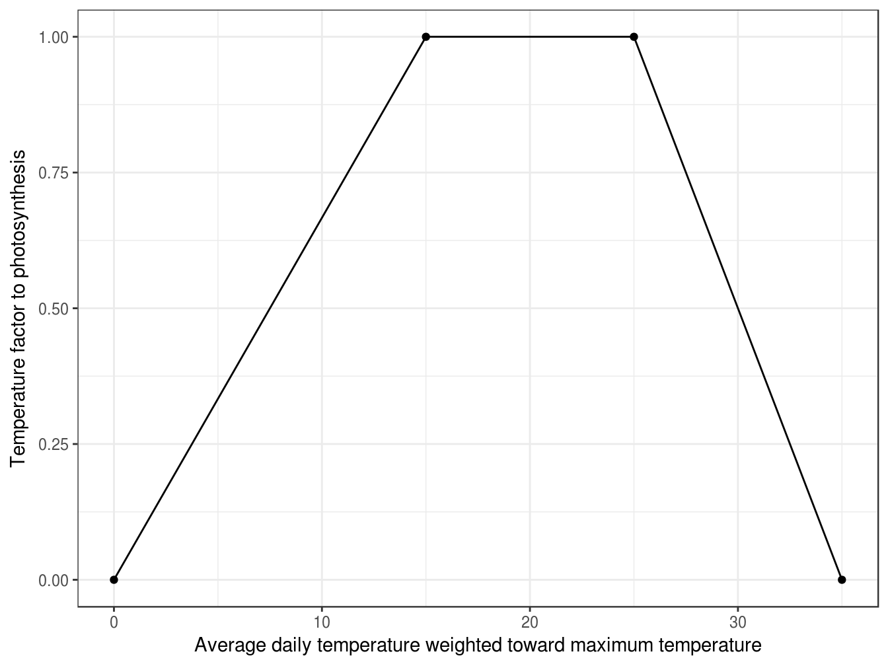
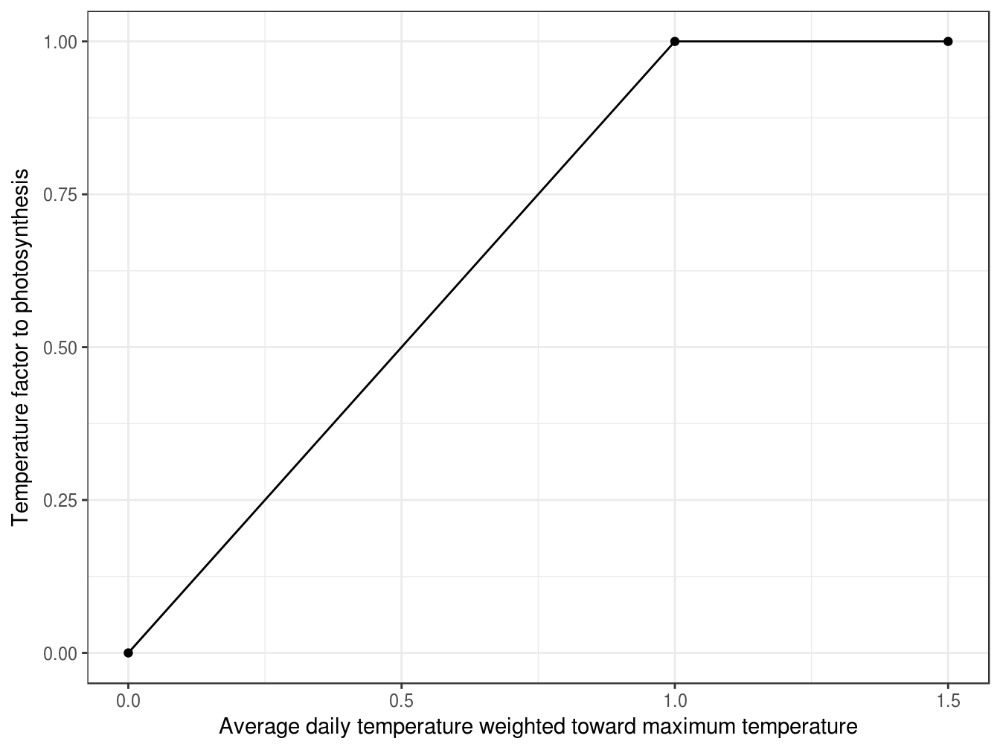

# Biomass {#cha:biomass}

The biomass and nitrogen of each organ is separated into three types of pools, i.e. structural, metabolic and non-structural [@brown_plant_2014].

* **Structural biomass and N** are essential for the growth of the organ. They remain within the organ once it has been allocated and are passed from Live to Dead pools as the organ senesces.
* **Metabolic biomass and N** are essential for growth and their concentration can influence the function of organs (e.g. photosynthetic efficiency of the leaf depends on Metabolic nitrogen content). Metabolic biomass and nitrogen may be reallocated (moved to another organ upon senescence of this organ) or retranslocated
(moved to another organ at any time when supplies do not meet the structural and metabolic biomass demands of growing organs).
* **NonStructural biomass and N** are non-essential to the function of an organ. They will be allocated to an organ only when all other organs have received their Structural and Metabolic allocations and may be reallocated or retranslocated.

## Biomass accumulation (Photosynthesis)

This section is directly copied from documentation of APSIM-Wheat 7.5. All details need to be checked for the APSIM next generation.

The daily biomass accumulation ($\Delta Q$) corresponds to dry-matter above-ground biomass, and is calculated as a potential biomass accumulation resulting from radiation interception ($\Delta Q_{r}$) that is limited by soil water deficiency ($\Delta Q_{w}$).

### Potential biomass accumulation from radiation use efficiency

The radiation-limited dry-biomass accumulation ($\Delta Q_{r}$) is calculated by the intercepted radiation ($I$), radiation use efficiency ($RUE$).

$$
\Delta Q_{r}=I \times RUE
$$

#### Radiation interception

Radiation interception is calculated from the leaf area index (LAI, m$^{2}$ m$^{-2}$) and the extinction coefficient (*k*) [@monsi_factor_2005]. 
$$
I=I_{0}(1-\exp(-k\times LAI)
$$

where $I_{0}$ is the total radiation at the top of the canopy (MJ) which is directly imported from weather records. Extinction coefficient ($k$) set as a constant value 0.5 in current version of APSIM.

#### Actual radiation use efficiency

The actual $RUE$ (g MJ$^{\text{-1}}$) is calculated as the potential $RUE$ ($RUE_p$) and several reduction factors, including plant nutrition ($F_{n,\ photo}$), air temperature($F_{t,\ photo}$), vapour pressure deficit ($F_{vpd}$), water supply ($F_w$) and atmospheric CO2 concentration ($F_{co2}$).

\begin{equation}
RUE = RUE_p \times \min{(F_{t,\ photo}, F_{n,\ photo}, F_{VPD})} \times F_W \times F_{CO2}
\end{equation}

*The potential RUE ($RUE_p$)* has a default value 1.5 in the current version of APSIM.

*The temperature factor ($F_t$)* is calculated as a function of average daily temperature weighted toward maximum temperature according to the specified `MaximumTemperatureWeighting` factor ($W_{maxt}$) with default value 0.75 (reference).

$$F_{t,\ photo}=h_{t,\ photo}[W_{maxt}T_{max}+(1-W_{maxt})T_{min}]$$

(\#fig:biomass-ft)The temperature factor which influences radiation use efficiency

*The plant nutrition factor* $f_{n,\,photo}$ is determined by the difference between leaf nitrogen concentration and leaf minimum and critical nitrogen concentration.

$$
f_{N,\,photo}=R_{N,\,photo}\sum_{leaf}\frac{C_{N}-C_{N,\,min}}{C_{N,\,crit}-C_{N,\,min}}\label{eq:NStressPhoto0}
$$

(\#fig:biomass-fn)The nitrogen factor which influences radiation use efficiency

where $C_{N}$ is the nitrogen concentration of `Leaf` parts; $R_{N,\,expan}$ is multiplier for nitrogen deficit effect on phenology which is specified by `N_fact_photo` in the wheat.xml and default value is 1.5.

#### The CO$_{\text{2}}$ factor

For C3 plants (like wheat), the CO$_{\text{2}}$ factor of APSIM is calculated by a function of environmental CO$_{\text{2}}$ concentration ($C$, ppm) and daily mean temperature ($T_{mean}$) as published by @reyenga1999modelling

$$f_{c}=\frac{(C-C_{i})(350+2C_{i})}{(C+2C_{i})(350-C_{i})}\label{eq:CO2Factor4Photosynthesis}$$

where $C_{i}$ is the temperature dependent CO$_{\text{2}}$ compensation point (ppm) and is derived from the following function. $$C_{i}=\frac{163-T_{mean}}{5-0.1T_{mean}}$$

#### Diffuse factor (not used in the current version)\[par:Diffuse-factor\]

The daily diffuse fraction was calculated using the functions suggested by @roderick1999estimating:

$$\begin{cases}
\frac{R_{d}}{R_{s}}=Y_{0} & \qquad for\:\frac{R_{s}}{R_{o}}\leq X_{0}\\
\frac{R_{d}}{R_{s}}=A_{0}+A_{1}\frac{R_{s}}{R_{o}} & \qquad for\:X_{0}<\frac{R_{s}}{R_{o}}\leq X_{1}\\
\frac{R_{d}}{R_{s}}=Y_{1} & \qquad for\:\frac{R_{s}}{R_{o}}>X_{1}
\end{cases}\label{eq:DiffuseFraction}$$

where $$\begin{array}{c}
A_{0}=Y_{1}-A_{1}X_{1}\\
A_{1}=\frac{Y_{1}-Y_{0}}{X_{1}-X_{0}}
\end{array}$$ where $R_{o}$ is the daily extra-terrestrial solar irradiance (i.e. top of the atmosphere); $R_{d}$ and $R_{s}$ are the daily diffuse and global solar irradiance at the surface, respectively. $X_{0}$, $X_{1}$, $Y_{0}$ and $Y_{1}$ are four empirical parameters. $$\begin{array}{l}
X_{0}=0.26,\qquad Y_{0}=0.96,\qquad Y_{1}=0.05,\;and\\
X_{1}=0.80-0.0017|\varphi|+0.000044|\varphi|^{2}
\end{array}$$ where $\varphi$ is latitude.

$R_{o}$ is derived from this function $$R_{0}=\frac{86400\times1360\times(\varpi\times\sin(\varphi)\times\sin(\theta)+\cos(\varphi)\times\cos(\theta)\times\sin(\varpi_{0}))}{1000000\pi}$$ where $\varpi_{0}$ is the time of sunrise and sunset, which derives from any solar declination ($\theta$) and latitude ($\varphi$) in terms of local solar time when sunrise and sunset actually occur (<http://en.wikipedia.org/wiki/Sunrise_equation>) $$\varpi_{0}=\arccos(-\tan(\varphi)\tan(\theta))$$ Solar declination ($\theta$) can be calculated by $$\theta=23.45\sin(\frac{2\pi}{365.25}(N-82.25))$$ where $N$ is day of year.

$f_{d}$ is calculated by a function of the diffuse fraction which is not implemented in current wheat module, (i.e. $f_{d}$ = 1).

### Actual daily biomass accumulation

The actual daily biomass accumulation ($\Delta Q$) results from water limitation applied on the potential radiation-driven biomass accumulation ($\Delta Q_{r}$). This water-limited biomass ($\Delta Q_{w}$) is a function of the ratio between the daily water uptake ($W_{u}$) and demand ($W_{d}$) capped by $$\Delta Q_{w}=\Delta Q_{r}f_{w,\,photo}=\Delta Q_{r}\frac{W_{u}}{W_{d}}\label{eq:WaterStressBiomassProduction-1}$$ where $f_{w,\,photo}$ is the water stress factor affecting photosynthesis (); $W_{u}$ is the actual daily water uptake from the root system (which corresponds to the soil water supply ($W_{s}$) capped by $W_{d}$), $W_{d}$ is the soil water demand of Leaf and Head parts ().

When the soil water is non-limiting ($f_{w,\,photo}$ = 1, i.e. $W_{d}\geq W_{s}$), biomass accumulation is limited by the radiation ($\Delta Q=\Delta Q_{r}$). When the soil water is limiting, biomass accumulation is limited by water supply ($\Delta Q=\Delta Q_{w}$).

The water demand ($W_{d}$, in mm) corresponds to the amount of water the crop would have transpired in the absence of soil water constraint, and is calculated from the potential biomass accumulation from RUE ($\Delta Q_{r}$). Following @sinclair1986waterand, transpiration demand is modeled as a function of the current day’s crop growth rate, estimated by the potential biomass accumulation associated with intercepted radiation ($\Delta Q_{r}$, see ), divided by the transpiration efficiency.

$$W_{d}=\frac{\Delta Q_{r}-R}{TE}\label{eq:soilWaterDemand-1}$$

where $R$ is respiration rate and equals to zero in the current version of APSIM-Wheat, $TE$ is transpiration efficiency (). See for more details about water demand and supply.

The daily biomass accumulation ($\Delta Q$) corresponds to dry matter above ground biomass is limited by the radiation interception ($\Delta Q_{r}$) or by soil water deficiency ($\Delta Q_{w}$), so that daily biomass accumulation can be expressed as: $$\Delta Q=\begin{cases}
\Delta Q_{r}\qquad & W_{u}=W_{d}\\
\Delta Q_{w}\qquad & W_{u}<W_{d}
\end{cases}\label{eq:actualBiomassProduction}$$ where $W_{s}$ is water supply, $W_{d}$ is the soil water demand from the shoot, limited by radiation interception (). In the current APSIM-Wheat, $W_{d}$ is actually only directly affected by the soil water demand of the leaf (). $W_{u}$ and $W_{d}$ are calculated by soil module of APSIM.

## Biomass partitioning

Photosynthate is not partitioned into root after heading [@fang_situ_2016].

