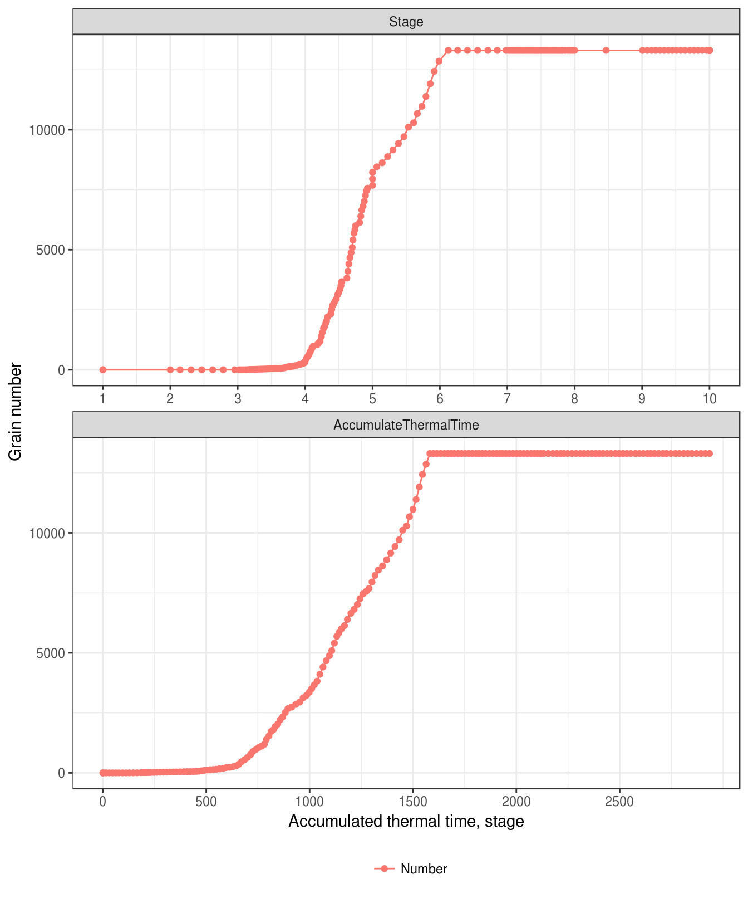
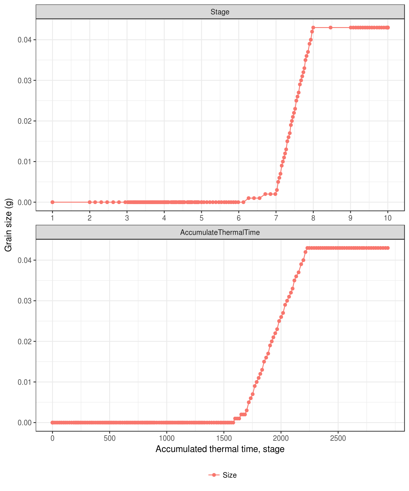
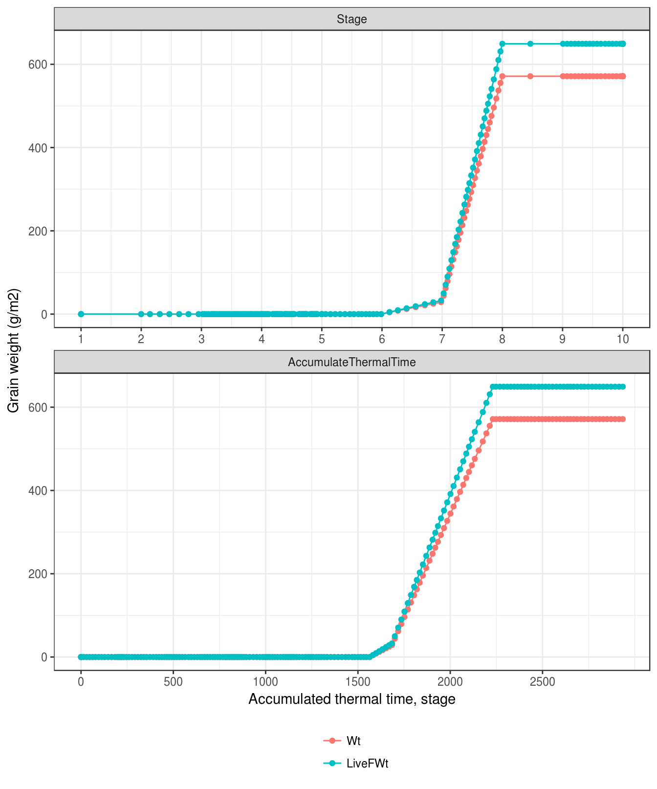
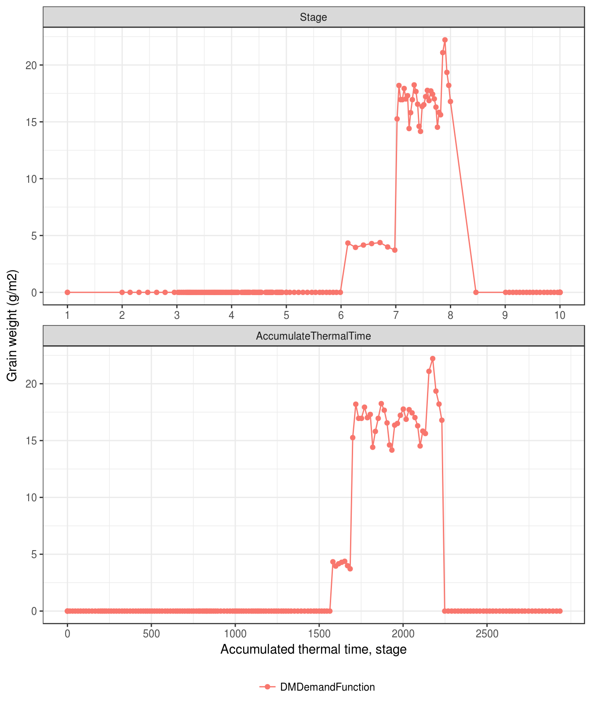

# Head development {#cha-head}

This section is directly copied from documentation of APSIM-Wheat 7.5. All details need to be checked for the APSIM next generation.

## Kernel number

The kernel number of wheat was simulated according the stem biomass at anthese in CERES [@moreno-sotomayor_improvements_2004], total above ground biomass at anthesis by O'Leary et al [-@oleary_simulation_1985].

The number of kernels per plant ($N_{g}$) is determined by the total weight of stem and spike organs ($W_{s}$). $$N_{g}=R_{g}W_{s}$$ where $R_{g}$ is the grain number per gram stem and spike with default value at 25 grain g^-1^.

In the previous version of APSIM-Wheat (7.8), the grain number is determined by the stem dry weight at anthesis.

(\#fig:grain-number)Grain number

(\#fig:grain-size)Grain size

(\#fig:grain-yield)Grain weight

(\#fig:grain-demand)Grain demand

### `Grain` (`Meal`) demand

The `Grain` demand (or `Meal` demand, $D_{g}$) is calculated in the growth phase `postflowering` (from flowering to end of grain filling ). $D_{g}$ equals to 0 before flowering.

$$D_{g}=N_{g}R_{p}h_{g}(T_{mean})f_{N,\,grain}\label{eq:MealDemand}$$

where $N_{g}$ is the grain number, $R_{p}$ is the potential rate of grain filling (0.0010 grain^-1^ d^-1^ from flowering to start of grain filling (); 0.0020 grain^-1^ d^-1^ during grain filling ()), $h_{g}(T_{mean})$ is a function of daily mean temperature which affects the rate of grain filling (0-1) and is defined by parameters `x_temp_grainfill` and `y_rel_grainfill` in wheat.xml and linearly interpolated by APSIM ().

$f_{N,\,grain}$ is a nitrogen factor to grain filling.

$$f_{N,\,grain}=\frac{h_{N,\ poten}}{h_{N,\ min}}h_{N,\,grain}\sum_{stem,\,leaf}\frac{C_{N}-C_{N,\,min}}{C_{N,\,crit}\times f_{c,\,N}-C_{N,\,min}}\qquad(0\leq f_{N,\,fill}\leq1)$$

where $h_{N,\ poten}$ is the potential rate of grain filling which is specified by `potential_grain_n_filling_rate` in wheat.xml and has a default value of 0.000055 g grain^-1^ d^-1^; $h_{N,\ min}$ is the minimum rate of grain filling which is specified by `minimum_grain_n_filling_rate` in wheat.xml and has a default value of 0.000015 g grain^-1^ d^-1^; $h_{N,\,grain}$ is a multiplier for nitrogen deficit effect on grain, which is specified by `n_fact_grain` in wheat.xml and has a default value of 1; $C_{N}$ is the nitrogen concentration of `Stem` or `Leaf` parts; $C_{N,\,crit}$ and $C_{N,\,min}$ are critical and minimum nitrogen concentration, respectively, for `Stem` and `Leaf` parts. $C_{N,\,crit}$ and $C_{N,\,min}$ are functions of growth stage and nitrogen concentration which is defined by parameters `x_stage_code`, `y_n_conc_min_leaf`, `y_n_conc_crit_leaf`, `y_n_conc_min_stem`, `y_n_conc_crit_stem` in wheat.xml and linearly interpolated by APSIM (); and $f_{c,\,N}$ is a factor with a value of 1 (i.e. no impact) for Stem, and is depending on CO~2~ for `Leaf` ().

Finally, `Grain` demand is limited by the maximum grain size (corresponding to $D_{gm}$) $$\begin{array}{c}
D_{g}=\min(D_{g},\,D_{gm})\\
D_{gm}=N_{g}S_{gm}-Q_{meal}\qquad(D_{gm}\geq0)
\end{array}$$ where $N_{g}$ is the grain number; $Q_{meal}$ is the dry weight of `Meal` part (i.e. the `Grains`); $S_{gm}$ is the maximum grain size which is specified by max\_grain\_size in wheat.xml and is a cultivar-specific parameter with 0.04 g for default value.

## `Pod`

`Pod` demand ($D_{p}$) is calculated by `Grain` demand ($D_{g}$, ) or daily biomass accumulation ($\Delta Q$, )

$$D_{p}=\begin{array}{c}
D_{g}h_{p}(S)\qquad D_{g}\text{>0}\\
\Delta Qh_{p}(S)\qquad D_{g}\text{=0}
\end{array}\label{eq:GrainDemand}$$

where $h_{p}(S)$ is a function of the growth stage ($S$) and of the `Pod` demand fraction of $D_{g}$ or $\Delta Q$. $h_{p}(S)$ is defined by parameters `x_stage_no_partition` and `y_frac_pod` in wheat.xml and linearly interpolated by APSIM ().
