# Leaf {#cha:leaf}


Leaf cohort model is used in the APSIM-Wheat.

## Life growth cycle

The growth cycle of leaf cohort is divided into 7 stages and 6 periods from `Initialized` to `Detached`. The length of each period depends on the `plastrochron` and `phylochron` for initialization and appearance and is configured by `CohortParameters` for others.

Several status variables are defined for each leaf cohort, which can be used in other modules to describe the current status of leaf cohort, i.e. `IsNotAppeared`, `IsGrowing`, `IsAlive`, `IsGreen`, `IsNotSenescing`, `Senescing`, `isFullyExpanded`, `ShouldBeDead`, `IsAppeared` and `IsInitialised`. 

<div class="fig-input">
<div class="figure" style="text-align: center">
<!--html_preserve--><div id="htmlwidget-f6ea0645d1cfd0e1944f" style="width:95%;height:470.4px;" class="DiagrammeR html-widget"></div>
<script type="application/json" data-for="htmlwidget-f6ea0645d1cfd0e1944f">{"x":{"diagram":"sequenceDiagram;\n\tInitialized->>Appeared: Appearance \n\tAppeared->>Expanded: GrowthDuration\n\tExpanded->>Senescing: LagDuration\n\tSenescing->>Senesced: SenescenceDuration\n\tSenesced->>Detaching: DetachmentLagDuration\n\tDetaching->>Detached: DetachmentDuration\n    Initialized->Appeared: IsNotAppeared\n    Initialized->Expanded: IsGrowing\n\tInitialized->>Senesced: IsAlive\n\tInitialized->>Senesced: IsGreen\n\tInitialized->>Senescing: IsNotSenescing\n\tSenescing->>Senesced: IsSenescing\n\tExpanded->>Detached: IsFullyExpanded\n\tSenesced->>Detached: ShouldBeDead\n\tSenesced->>Detached: Finished\n\tAppeared->>Detached: IsAppeared\n\tInitialized->>Detached: IsInitialised\n"},"evals":[],"jsHooks":[]}</script><!--/html_preserve-->
<p class="caption">(\#fig:leaf-life-cycle)The life cycle of a leaf cohort.</p>
</div>
</div>


### leaf age

The age of leaf cohort is defined as the thermal time after appearance, (i.e. keep zero after initialization). As the default values of `DetachmentLagDuration` and `DetachmentDuration` are set as `1000000` <sup>&deg;</sup>Cd, the cohort age keeps increasing until growth stage `ReadyForHarvesting`.

<div class="fig-output">

</div>

<div class="rmdimportant">
<p>The age of first leaf cohort starts from 200 °Cd.</p>
</div>


### Leaf initialization

A new leaf is initialized when the primordia number is increased by 1 at the main stem. Consequently, the total leaf cohort number is equal to total primordia number. The initialized rate of leaf cohort is equal to plastochron.

<div class="fig-output">

<div class="figure" style="text-align: center">
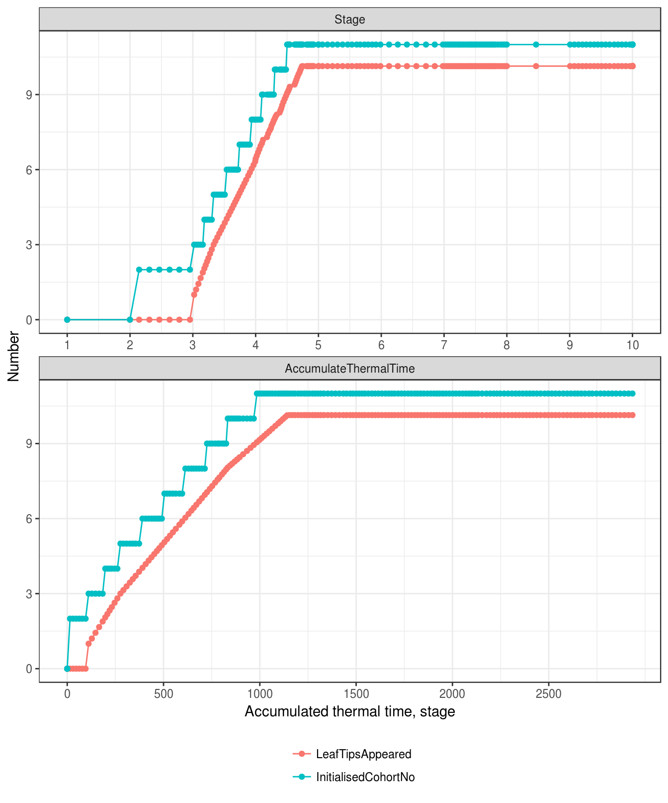
<p class="caption">(\#fig:leaf-init-number)The primordia number in the main stem and initialised cohort number</p>
</div>
</div>


<div class="rmdimportant">
<p>The plastochron supposed to 1.1 times of phyllochron. However the slope of Figure @ref(fig:leaf-init-number)B (plastochron) is constant which is contrast with the slope of @ref(fig:leaf-appear-number)B (phyllochron).</p>
</div>


### Leaf appearance 
A new leaf is appeared when the node number is increased by 1 at the main stem. Consequently, the appearance rate of leaf cohort is equal to phyllochron. Most of parameters of leaf cohort are determined at leaf appearance. 


<div class="fig-output">

<div class="figure" style="text-align: center">
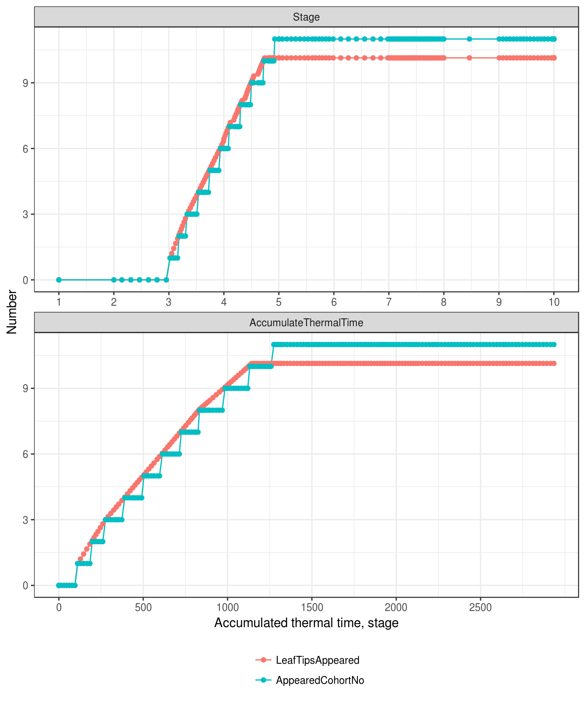
<p class="caption">(\#fig:leaf-appear-number)The node number in the main stem and appeared cohort number</p>
</div>
</div>

### Growth duration

In APSIM-Wheat model, leaf expansion of cohort $i$ starts from appearance of leaf tip $i$, i.e. the expasion of leaf cohort in the sheath is ignored which does not contribute to green leaf or leaf area index. The growth duration of spring wheat is close to one phylochron as the synchronization of leaf blade and sheath   [@skinner_elongation_1995].

As the variation of phyllochron (Fig. \@ref(fig:str-phyllochron)), the growth duration also changes by cohort rank. The growth duration of flag leaf is shorter than secondary leaf as the fraction of flag leaf (Fig. \@ref(fig:final-leaf-fraction).

<div class="fig-output">

</div>


### Lag duration 

Lag duration (full functional duration) is defined as 4 phyllochrons for leaf appeared during vegetative period (from emergence to terminal spikelet). For leaf cohort appeared during stem elongation period (from terminal spikelet to flag leaf), the lag duration equals to total length from stage `FlagLeaf` to stage `EndGrainFill` minus 3 phyllochron (`senescence duration`), i.e. flag leaf is completely death at the stage `EndGrainFill`. 


<div class="fig-output">

</div>

### Senescene and detachment duration

Senescence duration is defined as 3 phyllochrons. Detachment lag and detachment duration are set as a big value `1000000` which assumes no detachment in wheat. Actually all leaves are detached at `Harvesting` event. 

Figure \@ref(fig:leaf-cohort-number) shows the number of leaf cohort for expanding, initialized, appeared, senescing and dead cohort.

<div class="fig-output">
<div class="figure" style="text-align: center">
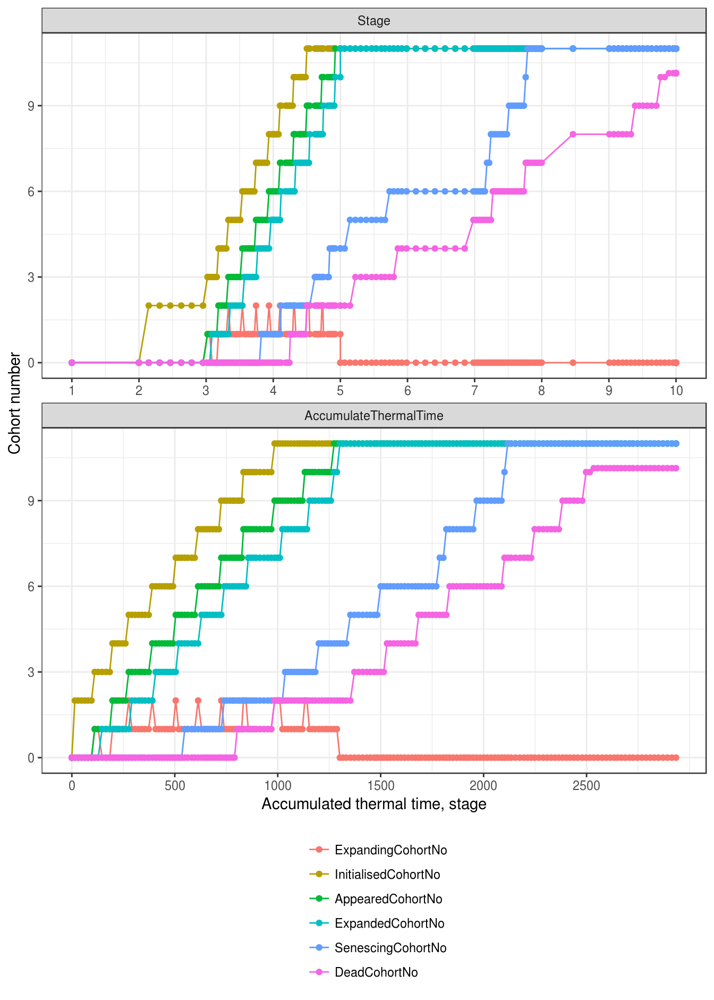
<p class="caption">(\#fig:leaf-cohort-number)Initialized, appeared and expanding cohort number</p>
</div>
</div>

<div class="rmdimportant">
<p>The expanding leaves are jumping up and down which is caused by the strange duration of leaf growth. We should expect the same growth duration for Leaf 1 and Leaf 2, Leaf 3, 4 and 6.</p>
</div>

### Drought stress

After appearance, leaf development is accelerated by the drought stress through increasing the daily thermal time, i.e. leaf age is accelerated by drought. The factor of acceleration depends on the ratio of water supply and demand (Figure \@ref(fig:water-supply-demand-ratio)). Daily thermal time is doubled when there is no water supply (i.e. Ratio of water supply and demand equals to zero), and no acceleration when ratio above 0.7 (The values in Figure \@ref(fig:leaf-development-drought) plus one).


<div class="fig-input">
<div class="figure" style="text-align: center">
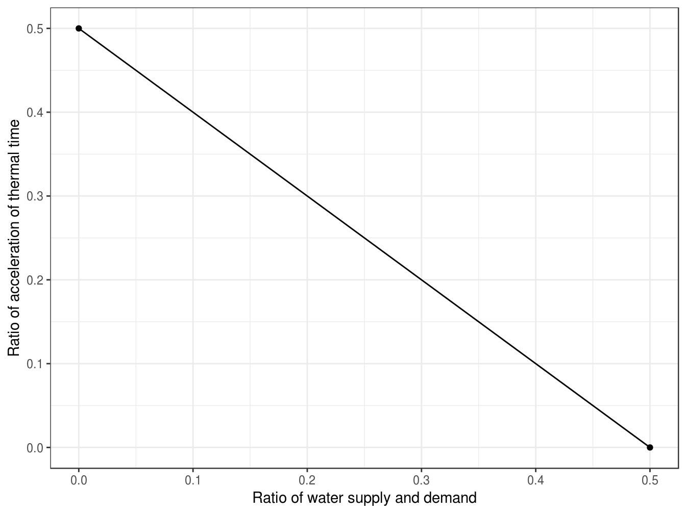
<p class="caption">(\#fig:leaf-development-drought)Drought stress accelerates leaf development. Daily thermal time is doubled when there is no water supply (i.e. Ratio of water supply and demand equals to zero), and no acceleration when ratio above 0.7.</p>
</div>
</div>


```csharp
//Acellerate thermal time accumulation if crop is water stressed.
double _ThermalTime;
if ((LeafCohortParameters.DroughtInducedSenAcceleration != null) && (IsFullyExpanded))
    _ThermalTime = TT * LeafCohortParameters.DroughtInducedSenAcceleration.Value;
else _ThermalTime = TT;

```


## Cohort population

Cohort population is initialized as the total stem population at appearance of leaf cohort, and proportionally reduced by plant and stem mortalities (\@ref(#sec-structure-mortality)) at each day after appearance.

<div class='fig-output'>

</div>

The total leaf number is multiplied by leaf cohort number and stem number (Figure \@ref(fig:leaf-number)).

<div class="fig-output">
<div class="figure" style="text-align: center">
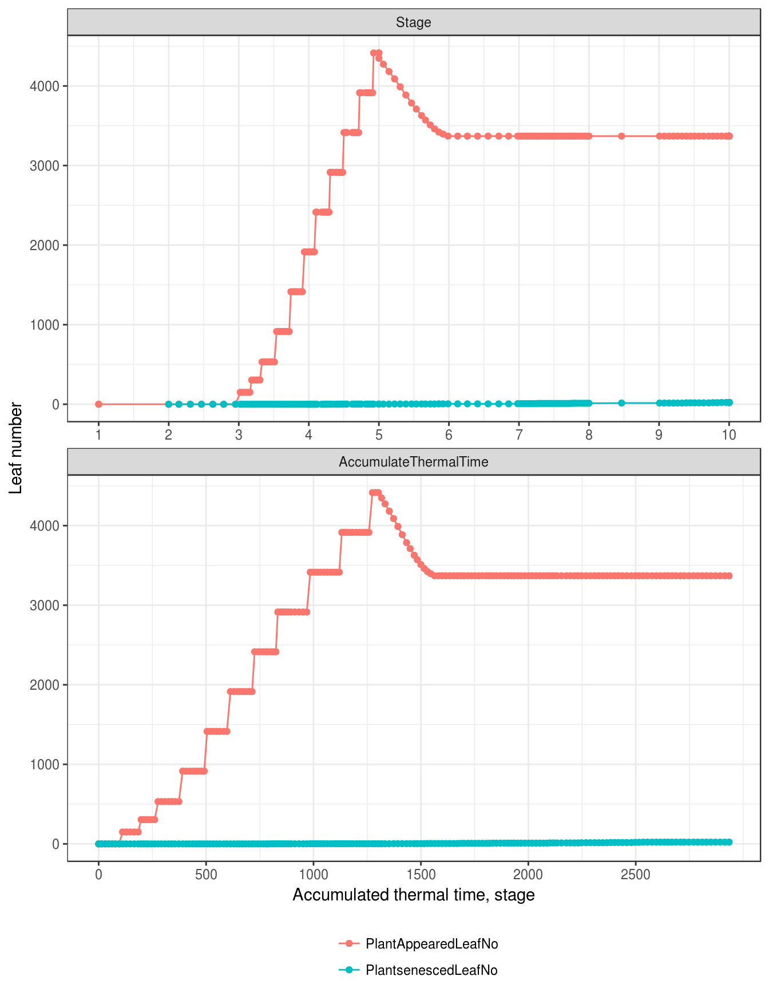
<p class="caption">(\#fig:leaf-number)Appeared number of green, senesced and total leaves</p>
</div>
</div>


<div class="rmdimportant">
<p>The tiller death is detached from plants, but leaf death isn't detached.</p>
</div>


The fraction of final leaf is set as 1, but return the actual fraction of the final leaf if the last leaf has appeared. 

<div class="fig-output">

</div>


## Development of leaf size

During the growth duration of each cohort, the daily increase of leaf area is detemined by the minimum increase of water ($\Delta A_{water}$) and carbon ($\Delta A_{carbon}$) constrained leaf area. 


### Maximum (potential) leaf area

The maximum leaf area of each leaf cohort is determined by potential maximum leaf area and reduced by cell division stress and final leaf fraction when leaf cohort is appeared. 


The potential maximum leaf areas by rank are specified by two parameters the maximum leaf area in all leaves (`AreaLargestLeaves` with default value 2600 mm^2^) and an age factor (Figure \@ref(fig:maximum-area-age)). The age factor is assumed leaf areas are linearly increasing from stage `Emergence` to `Terminal spikelet`, and all leaves appeared after stage `Terminal Spikelet` have the same maximum leaf area (the last three leaves in the current configuration of plastochron and phyllochron, Figure \@ref(fig:node-number)).

<div class="rmbimportant">
<p>The function of maximum leaf size is proposed to change. Documentation needs to update.</p>
</div>


<div class="fig-input">

</div>


The stress factor of cell division is determined by water (Figure \@ref(fig:water-supply-demand-ratio)) and nitrogen stresses (Figure \@ref(fig:nitrogen-functional-nitrogen)). Stress of cell division is averaged by cell division stress factors from initialization to appearance.

In the test simulation, the maximum leaf areas are increasing from Rank 1 to Rank 9, then decreasing to flag leaf (Figure \@ref(fig:leaf-cohort-max-area)), which is caused by nitrogen stress after terminal spikelet (Figure \@ref(fig:nitrogen-functional-nitrogen)). 

<div class="fig-output">

</div>


### Potential expansion of leaf cohort

The potential leaf area is calculated by a logistic equation as a function of thermal time after leaf appearance. The shape of logistic equation is determiend by parameter `LeafSizeShapeParameter` with default value `0.3` (Fig. \@ref(fig:size-function)). 

<div class="figure" style="text-align: center">
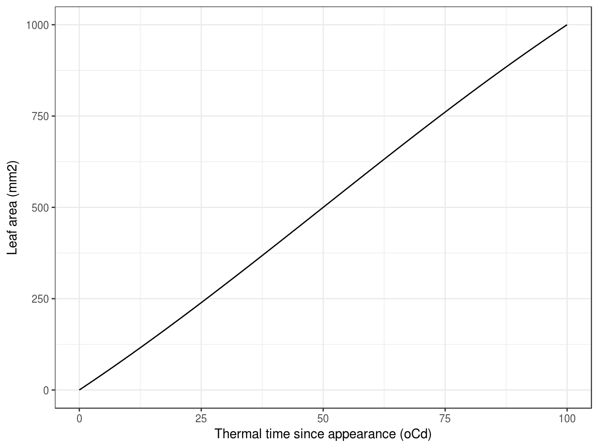
<p class="caption">(\#fig:size-function)The size function of leaf area development</p>
</div>


### Water constrained leaf area

The potential increase of leaf area is reduced by `ExpansionStress` with default value 1


### Carbon constrained leaf area

<div class="fig-output">

</div>


<div class="fig-output">
<div class="figure" style="text-align: center">
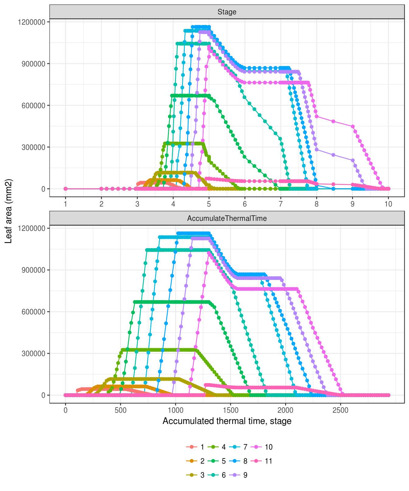
<p class="caption">(\#fig:leaf-cohort-area)Leaf area by leaf cohort</p>
</div>
</div>


Not sure about the meaning of leaf size?

<div class="fig-output">
<div class="figure" style="text-align: center">
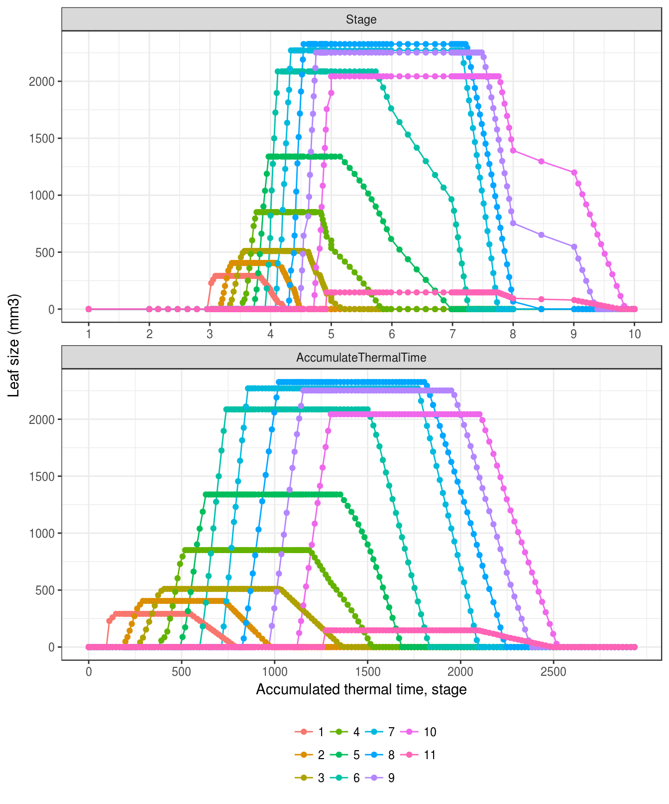
<p class="caption">(\#fig:leaf-cohort-size)Leaf size by leaf cohort</p>
</div>
</div>


Leaf area index (LAI) are calculated for green leaf ($\text{LAI}_{g}$), dead leaf ($\text{LAI}_{d}$), and total leaf ($\text{LAI}_{t}$). 


<div class="fig-output">
<div class="figure" style="text-align: center">
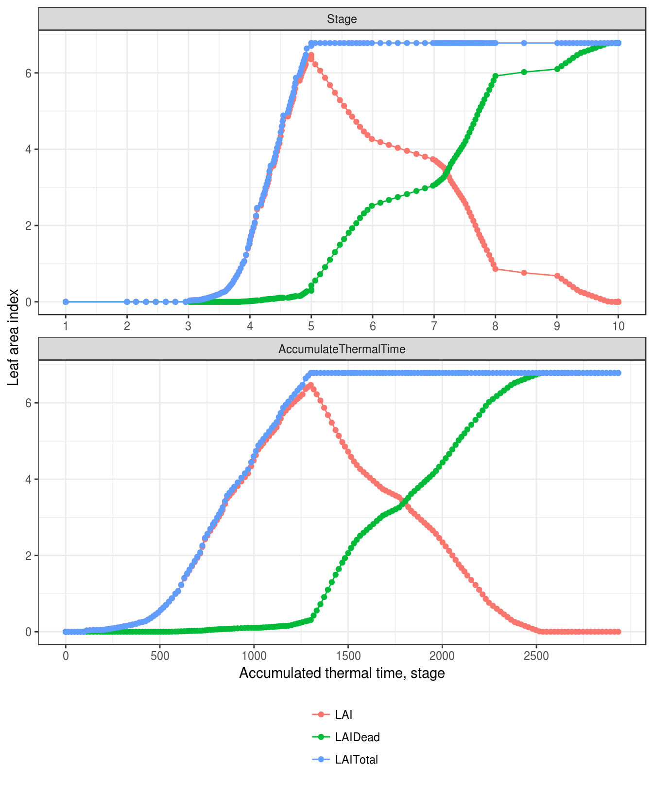
<p class="caption">(\#fig:leaf-lai)Leaf area index</p>
</div>
</div>


## Ground coverage

and coverage are calculated for green leaf ($C_g$), dead leaf ($C_d$), and total leaf ($C_t$) from LAI and extinction coefficient for green leaf ($k_{g}$) and dead leaf ($k_{d}$). 

$$
C_{g}=C_{max}(1-\exp(-k_{g}\frac{\text{LAI}_{g}}{C_{max}}))
$$

As the default value of maximum coverage ($C_{max}$) is 1, the function is reduced to
$$
C_{g}=1-\exp(-k_{g}\text{LAI}_{g})
$$

The similar equation is used for dead coverage.

$$
C_{d}=1-\exp(-k_{d}\text{LAI}_{d})
$$

Total coverage ($C_t$) is calculated from coverage of green and dead leaves.
$$
    C_{t} = 1 - (1 - C_{g})(1 - C_{d})
$$

The extinction coefficient for dead leaf ($k_{d}$) is defined as 0.3. The extinction coefficient for green leaf ($k_{g}$) is calculated by parameter `ExtinctionCoeff` which is depending on LAI and water stress.  

In the current version of APSIM-Wheat, extinction coefficient is set as 0.5 without variation as leaf area index. 

<div class="rmdnote">
<p>Extinction coefficient of dead leaf (<span class="math inline"><em>k</em><sub><em>d</em></sub></span>) is not setable in the APSIM User Interface which is defined in the xml file.</p>
</div>


<div class="fig-input">

</div>

The extinction coefficient of green leaf is adjusted by water stress which is the ratio of water supply and demand. No adjustment is applied to extinction coefficient if water supply is more than water demand. However, extinction coefficient is reduced when water supply is less than water demand (Figure \@ref(fig:k-water-stress), i.e. $k$ = 0.25 when no water supply).

<div class="fig-input">

</div>


<div class="fig-output">
<div class="figure" style="text-align: center">
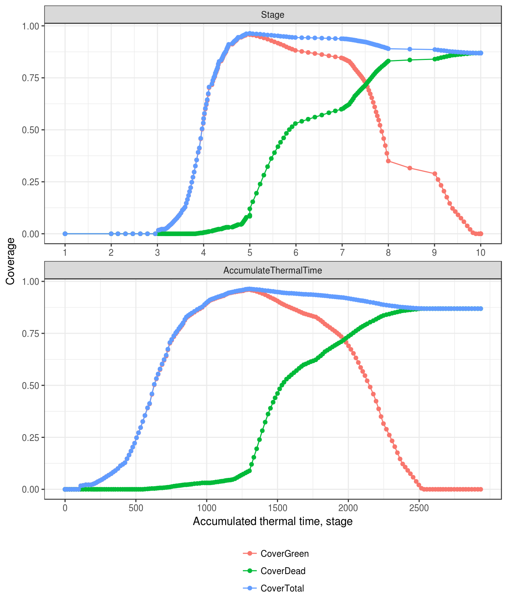
<p class="caption">(\#fig:leaf-cover)Coverage</p>
</div>
</div>


## Leaf biomass

Biomass supply

Biomass demand

<div class="fig-output">
<div class="figure" style="text-align: center">
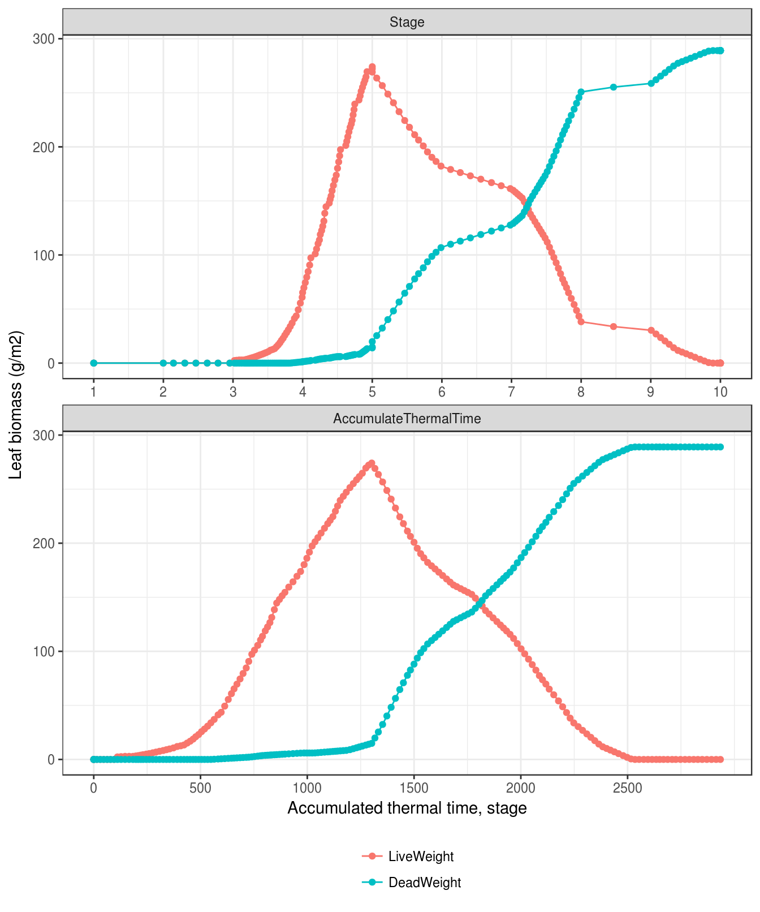
<p class="caption">(\#fig:leaf-biomass)Leaf biomass</p>
</div>
</div>


<div class="fig-output">
<div class="figure" style="text-align: center">
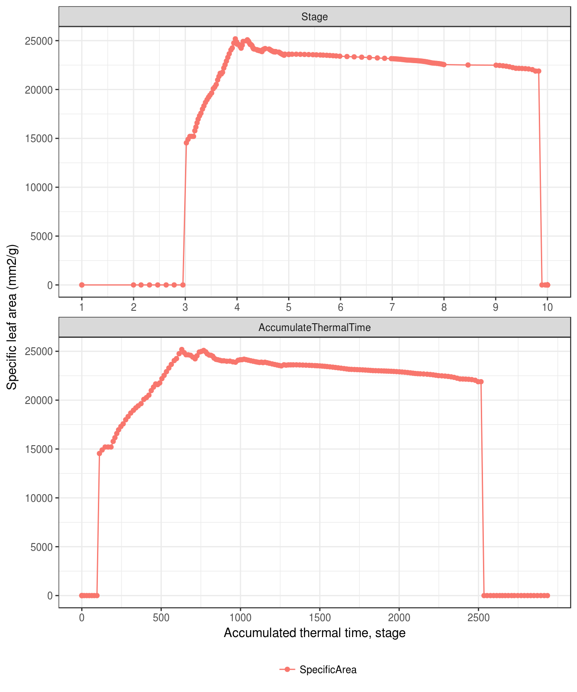
<p class="caption">(\#fig:leaf-specific-leaf-area)Specific leaf area</p>
</div>
</div>


<div class="fig-output">
<div class="figure" style="text-align: center">
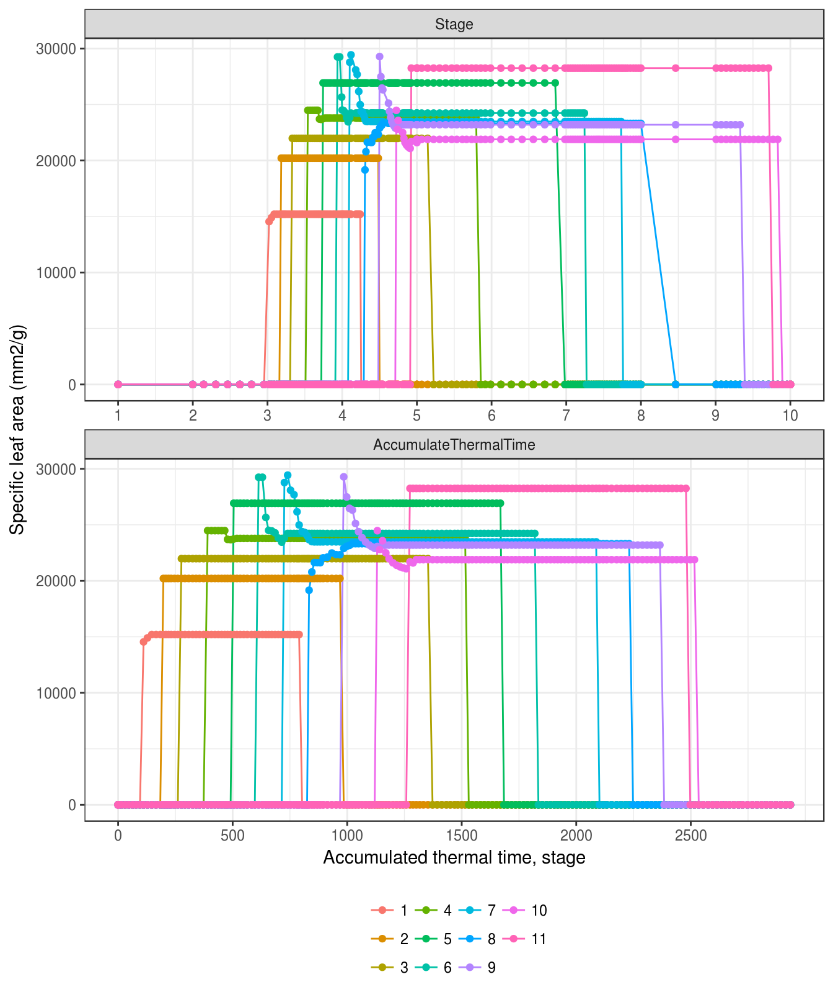
<p class="caption">(\#fig:leaf-cohortspecific-leaf-area)Specific leaf area by cohort</p>
</div>
</div>

<div class="rmdwarning">
<p>Why does specific leaf area of flag leaf decrease after a few days of appearance.</p>
</div>


## Frost impact 

Kill a fraction in all leaves ...
