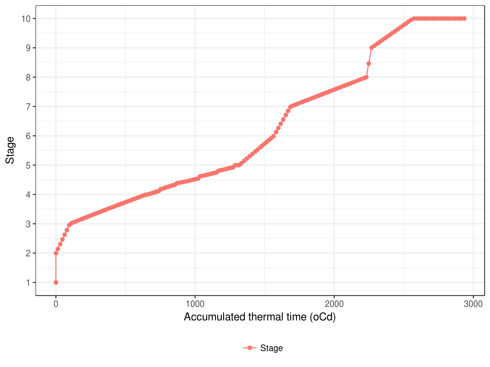

# Phenology {#cha-phenology}

## Thermal time

The daily thermal time is calculated using daily records of maximum and minimum temperature. Before the terminal spikelet stage, the soil temperature is estimated using soil model in APSIM and used to calcualte the thermal time. After terminal spikelet stage, the air temperature is directly used. 

## Stages and periods {#stage-period}

The growth cycle of wheat is started from sowing and finished at harvest ripe.The whole cycle is separated into 10 stages and 10 phases. Wheat jumps into next stage or phase when certian conditions are statisfied (earliness "per se", vernalization and photoperiod).

Stage | Name                      | Description
----- | ------------------------- | -------------------------------------------
1     | Sowing                    | Sow seeds into field
2     | Germination               | Germination begins when the seed imbibes water from the soil and reaches 35 to 45 percent moisture on a dry weight basis
3     | Emergence                 | The coleoptile extends to the soil surface
4     | TerminalSpikelet          | The terminal spikelet initial is formed
5     | FlagLeaf                  | The appearance of flag leaf tip or ligule (??)
6     | Flowering                 | The 50% plants are flowering in the field
7     | StartGrainFill            | Grain filling follows anthesis and refers to the period during which the kernel matures or ripens 
8     | EndGrainFill              | Grain filling follows anthesis and refers to the period during which the kernel matures or ripens
9     | Maturity                  | Grain dry weight reaches its maximum which is correlated to the absence of green color in the chaff or kernels 
10    | HarvestRipe               | Wheat is ready for harvest

Each phase has a targer thermal time (earliness *per se*) and several impact factors to extend the growing period including vernalization, photoperiod, water, nitrogen stresses. 

Name                      | Earliness per se   | Vernalization | Photoperiod | Description
------------------------- | -----------------  | ------------- | ----------- | -------------------------------------------
Germinating               | NA                 | NA            | NA          | Depending on soil water in top layer
Emerging                  | $Lag + Rate*depth$ | NA            | NA          | Depending on the sowing depth        
Vegetative                | NA                 | NA            | NA          | NA
StemElongation            | NA                 | NA            | NA          | NA  
EarlyReproductive         | NA                 | NA            | NA          | NA
GrainDevelopment          | NA                 | NA            | NA          | NA 
GrainFilling              | NA                 | NA            | NA          | NA 
Maturing                  | NA                 | NA            | NA          | NA 
Ripening                  | NA                 | NA            | NA          | NA 
ReadyForHarvesting        | NA                 | NA            | NA          | NA 

(\#fig:leaf-tt-stage)The growthing stage as a function of accumulated thermal  time 

The changing growthing stage in during period 4 looks strange as there are big jump at the start and end of period.

