# Structure {#cha-structure}

The Structure model predicts the development and mortality of phytomer and branch (tiller) according to plastochron and phyllochron. 

## Plastochron and phyllochron {#plastochron-phyllochron}

A plastochron is defined as the time interval between two successive recurring events during the growth of plant shoots, such as leaf initiation. The phyllochron is the intervening period between the sequential emergence of leaves on the main stem of a plant [@mcmaster_re-examining_2003].

The non-linear reponse of temperature on phyllchron were observed by Friend et al. [-@friend_leaf_1962]  and Cao and Moss [-@cao_temperature_1989]. The soil temperature provided more accurately prediction of leaf development than air temperature [@jamieson_prediction_1995]. However, a simple linear reponse of phyllochron to air temperature works surprusingly well in predicting phyllochron for most field conditions [@mcmaster_re-examining_2003]. If improvements are desired, the use of non-linear reponses and soil temperature shows promise [@jamieson_prediction_1995; @yan_equation_1999]. Consequently, we assume the linear reponse of air temperature on leaf appearance (phyllochorn) in the current APSIM-Wheat model.  

Brown et al. [-@brown_integration_2013] showed final leaf number (FLN) could be estimated as 2.86 + HSTS * 1.1 where HSTS is the the Haun stage at terminal spikelet. To caputre this in the wheat model we have set the initial number of primordia (determined by the number of initialleaf objects on the leaf class) to 3 and have set this function to produce primordia 10% faster than mainstem leaves.  Primordia are initiated until the therminal spikelet stage and then the number remains fixed, giving final leaf number.

Based on [@jamieson_prediction_1995], leaf appearance could be described by a base phyllochron determined between leaves 2 and 7 and a phyllochron that was 70% of base phyllochron for leaves < 2 and 130% of base phyllochroen for leaves > 7. The base phyllochron set as 100 oCd.

In the wheat model, we use a fake plastochron when are calculated from  emergence to terminal spikelet.

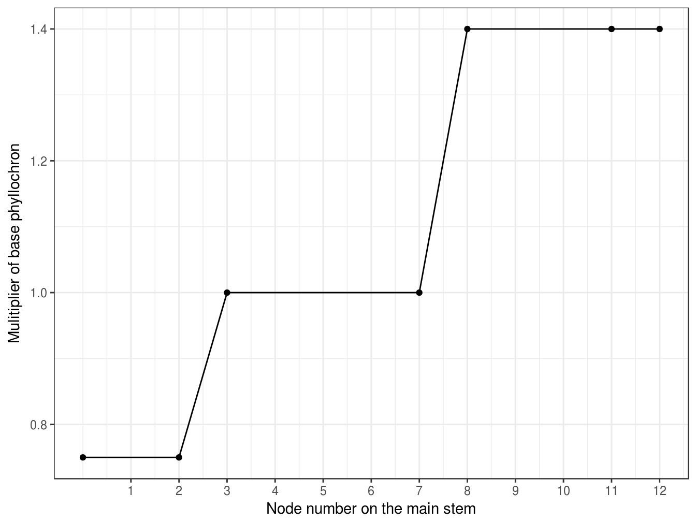

(\#fig:str-phyllochron)Phyllochron of leaf cohort is depending on the rank on the main stem

## Promordia and node number

Three primordias are initialized at stage Emergence (Section \@ref(stage-period)). The primordia number in main stem (MainStemPrimordiaNo, Section \@ref(output-structure)) is daily increased according to plastochron (Section \@ref(plastochron-phyllochron)) until stage Terminal Spikelet (Section \@ref(stage-period)). The leaf (`node` in [next generation APSIM](https://github.com/APSIMInitiative/ApsimX)) number in the main stem is daily increased according to the phyllochron (Section \@ref(plastochron-phyllochron)) until maximum leaf number is reached. 

The total leaf number in the main stem (MainStemFinalNodeNumber, Section \@ref(output-structure)) is initialized as 30 and reset as the primordia number at stage Terminal Spikelet (Section \@ref(stage-period)). The node number in the main stem (MainStemNodeNo, Section \@ref(output-structure)) is daily increasing since stage  Emergence (Section \@ref(stage-period)) until reach the final node number according to the `phyllochron` and daily thermal time. 

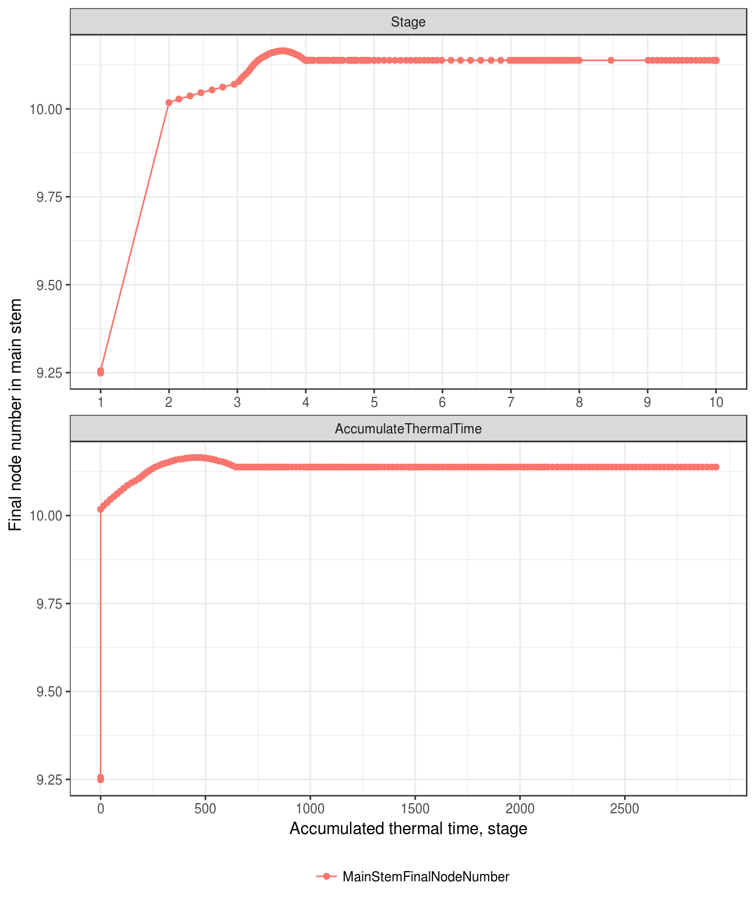

(\#fig:final-node-number)Final node number in main stem

Daily changes of primordia ($\Delta N_{pri}$) and node (leaf) ($\Delta N_{node}$) number in main stem are calculated using plastochron ($P_{pla}$) and phyllochron ($P_{phy}$), respectively, after plant stage Emergence (Section \@ref(stage-period) and Figure \@ref(fig:delta-node)).

$$
 \Delta N_{pri}=rac{\Delta TT_{d}}{P_{pla}}
$$

$$
 \Delta N_{node}=rac{\Delta TT_{t}}{P_{phy}}
$$

where, $\Delta TT_{t}$ is the daily thermal time, which calculates from parameter `ThermalTime`. $P_{pla}$ and $P_{phy}$ calculates from parameter `MainStemPrimordiaInitiationRate` (plastochron) and `MainStemNodeAppearanceRate` (phyllochron), respectively (Section \@ref(plastochron-phyllochron)).

The daily delta primordia number is not a output variable.

Total number of primordia ($N_{pri}$) and node ($N_{node}$) in main stem are summarized since initialization.

$$
    N_{pri}=\sum_{t=T_{0}}^{T}\Delta N_{p}
$$

$$
    N_{node}=\sum_{t=T_{0}}^{T}\Delta N_{n}
$$

where, $T_{0}$ is day of plant initialization which is set by Leaf model (Emergence for wheat).  $T$ is today. In the Structure model, the primordia and node numbers are not calculated for branches or tillers, but only for main stem (Figure \@ref(fig:node-number)). 

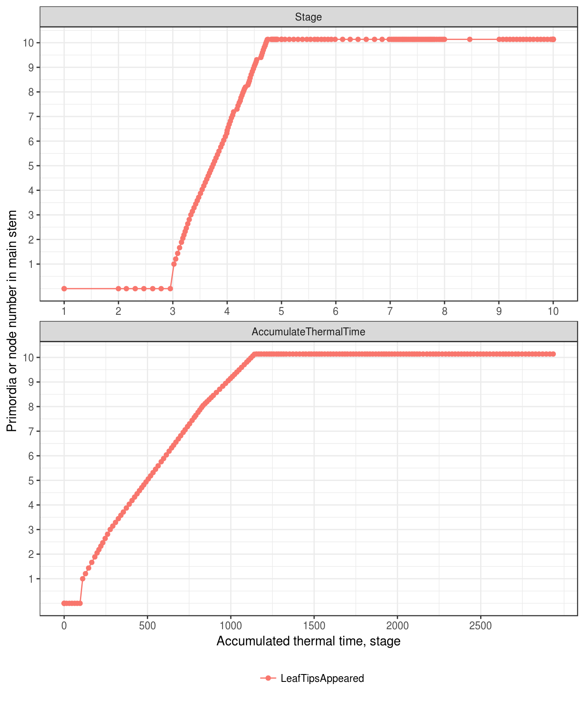

(\#fig:node-number)Primordia and node number in main stem

The primordia and node numbers in the main stem are not necessary integar to simulate the variation of primordia number in the actual field. Consequently all attibutes of flag leaf are proportionally reduced (e.g. growth duration and maximum area).

The relative appeared node number (`RelativeNodeAppearance`) is calculated as the fraction  of appeared node number on the final node number. As the final node number is initialized as 30 as reset to primordia number at the stage `Terminal Spikelet`, the output variable `RelativeNodeAppearance` is suddenly increased at stage `Terminal Spikelet` (Figure \@ref(fig:relative-node-number)).

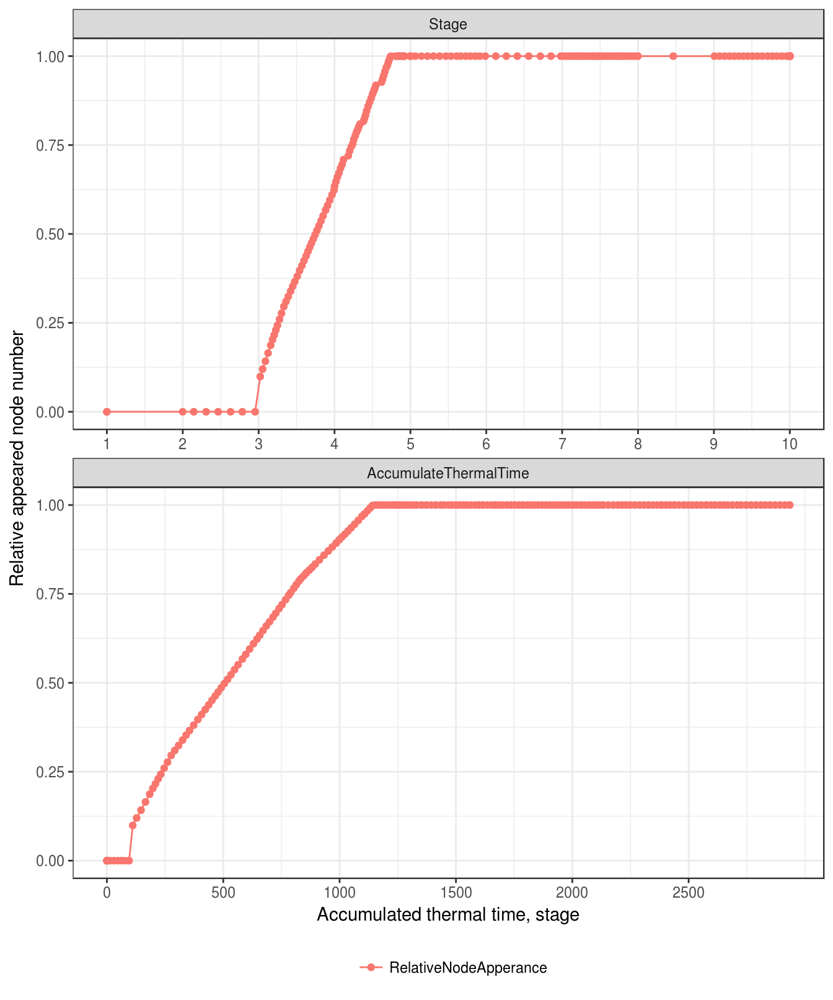

(\#fig:relative-node-number)The fraction of appeared node nubmer on the final node number

## Tillering

The tiller number is too sensitive to WSC stress (x = [0.1, 0.2]; y = [0, 1]). This feature is disabled in all analysis

In [next generation APSIM](https://github.com/APSIMInitiative/ApsimX), tillering for wheat is referred as branching. New tillers are initialized when increase of the node number in 
main stem ($\Delta N_{node}$) is more than 1 although the branching rate ($\Delta N_{branch}$) is calculate everyday (Figure \@ref(fig:tiller-number)). 

The new branch number for each plant 
is specified by parameter BranchingRate ($\Delta N_{branch}$), which could be a function of 
branch number on leaf rank in main stem.
$$
     P_{branch} = P \times \sum_{t=T_{0}}^{T}\Delta N_{branch}
$$

The branching rate is defined by potential branching rate and stresses (nitrogen and WSC). From stage Emergence to Terminal Spikelet (Section \@ref(stage-period)), the potential branching rate is defined as  a function of number of appeared cohorts in the main stem (Figure \@ref(fig:branching-rate)). Beyond this period, the branching rate is set as zero. 

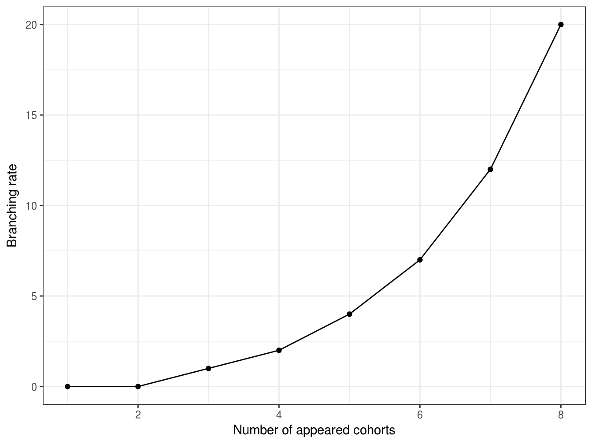

(\#fig:branching-rate)Branching rate of APSIM-Wheat as a function of appreared cohort number

Two stresses are defined in the APSIM-Wheat including nitrogen and WSC. A simple sensitivity analysis indicates the branching rate is too sensitive to WSC with default values (x = [0.1, 0.2]; y = [0, 1]). So, this feature is disabled for further analysis. 

The nitrogen stress is calculated as a function of fraction of nitrogen supply relative to nitrogen demand which is exported from the Arbitrator module (Chapter \@ref(cha:arbitrator)). Wheat module assumes no nitrogen stress when the nitrogen supply is bigger than 1.5 times of nitrogen demand (Figure \@ref(fig:branching-rate-nstress)). Nitrogen stress linearly increases when supply/demand ratio less then 1.5 (Reference required.)

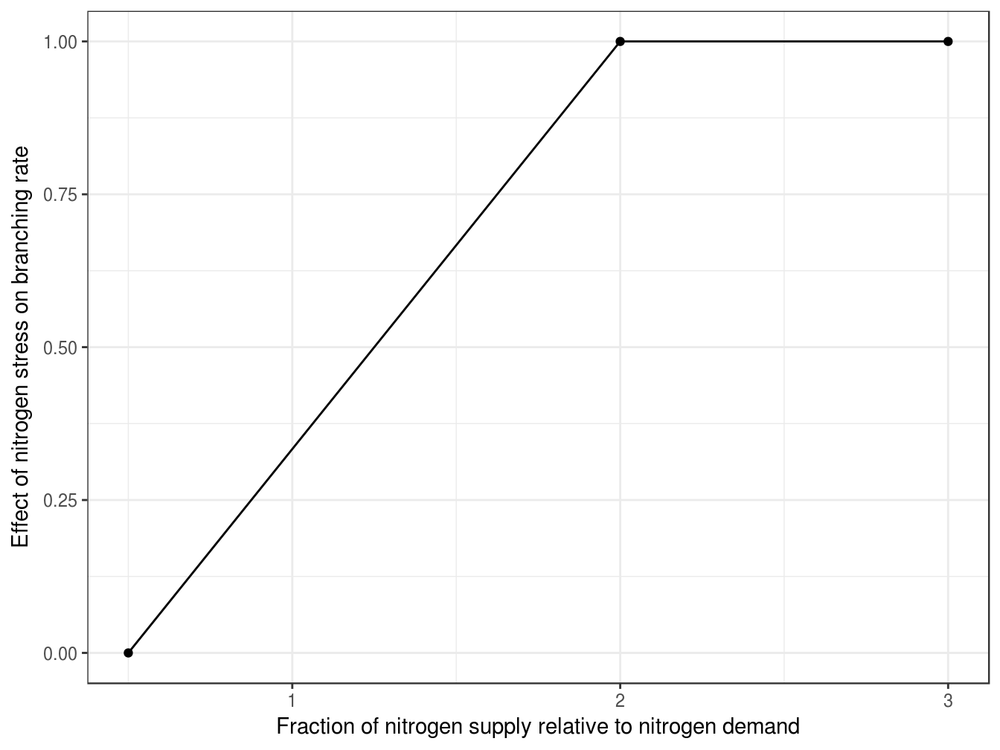

(\#fig:branching-rate-nstress)Nitrogen stress on branching rate as a function of fraction of nitrogen supply relative to nitrogen demand

Figure \@ref(fig:tiller-number) shows the branching rate and total branching number in the test simulation without nitrogen stress on branching rate during branching period (from Emergence to Terminal Spikelet, Figure \@ref(fig:nitrogen-fn)).

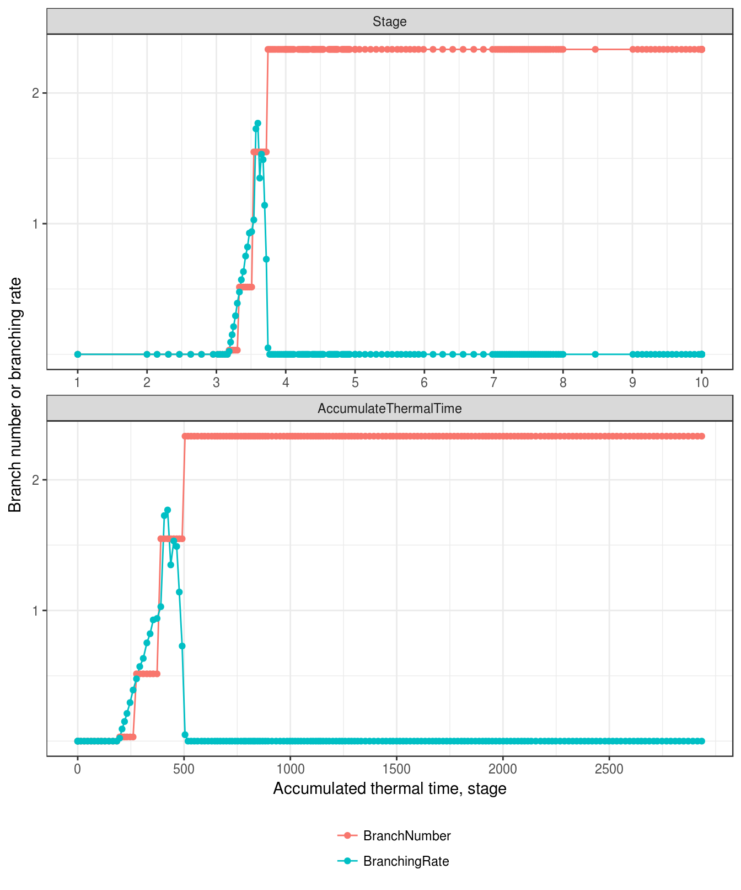

(\#fig:tiller-number)The branching rate and branch number for wheat

It seems PMF uses the branching rate one day before to calculate the branch number.

## Population

Plant population ($P$) is initialized at sowing from Sow event, and daily reduced by the plant mortality ($\Delta P$).
$$
    P=P_{0} - \sum_{t=T_{0}}^{T}(\Delta P)
$$

where, $P_{0}$ is the sown population, which initialized at sowing.

Population of main stem ($P_{ms}$) is calculated according to plant population ($P$) and primary bud number ($N_{bud}$) with default value 1. The unit of $P_{ms}$ is per square meter.
$$
    P_{ms}=P \times N_{bud}
$$

Population of total stem ($P_{stem}$) is summed up population of main stem ($P_{ms}$) and branches (($P_{branch}$)).
$$
    P_{stem} = P_{ms} + P_{branch}
$$

In the test simulation, the plant density ($P$) is 150 plants m^2^, so population of main stem ($P_{ms}$) equals to plant density (Figure \@ref(fig:plant-population)). From Emergence to terminal spikelet, the population of total stem ($P_{stem}$) multiply by stem number and plant density (Figure \@ref(fig:tiller-number)). 

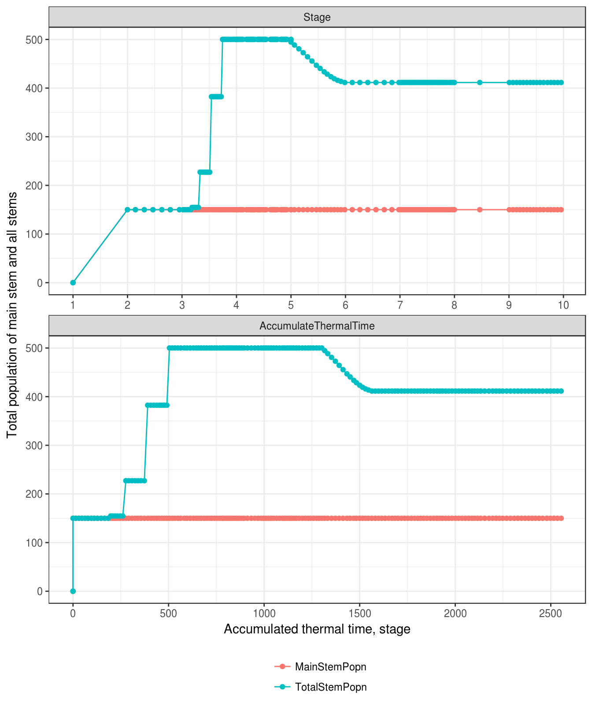

(\#fig:plant-population)The total population of main stem and all stems

## Mortality {#sec-structure-mortality}

Branching mortality starts from the Terminal Spikelet until Flowering which defines as a function of moving mean tiller growth rate (Figure \@ref(fig:mortality-growth-rate). The mean tiller growth rate is calculated as the 5 days moving means of tiller growth rate, which is calculated by the daily biomass supply divides thermal time and total stem population.  Reference required.

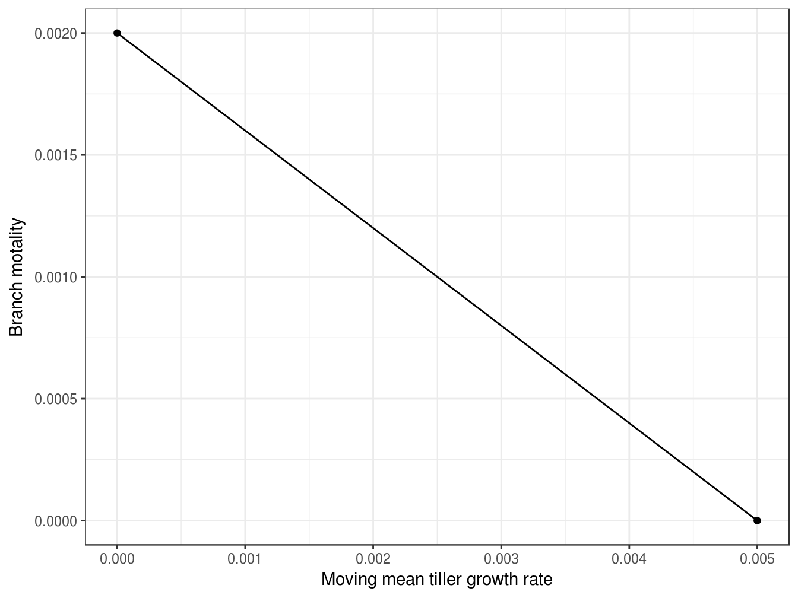

(\#fig:mortality-growth-rate)Tiller mortality as a function of moving mean tiller growth rate

Figure \@ref(fig:tiller-growth-rate-factor) and \@ref(fig:tiller-growth-rate) show the mean tiller growth rate and the three factors to calculate it in the test simulation.

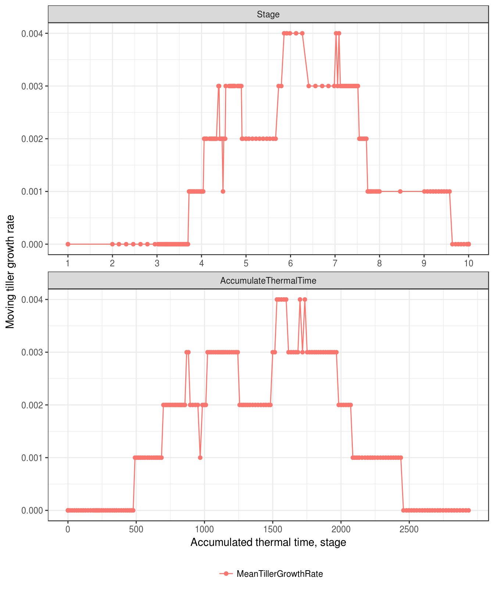

(\#fig:tiller-growth-rate)The moving tiller growth rate

As the primary bud number is equal to 1, the plant total node number and total primary node number are the same (Figure \@ref(fig:plant-node-number)). Figure \@ref(fig:plant-node-number) show the total node number as the results of tiller appearing and mortality.

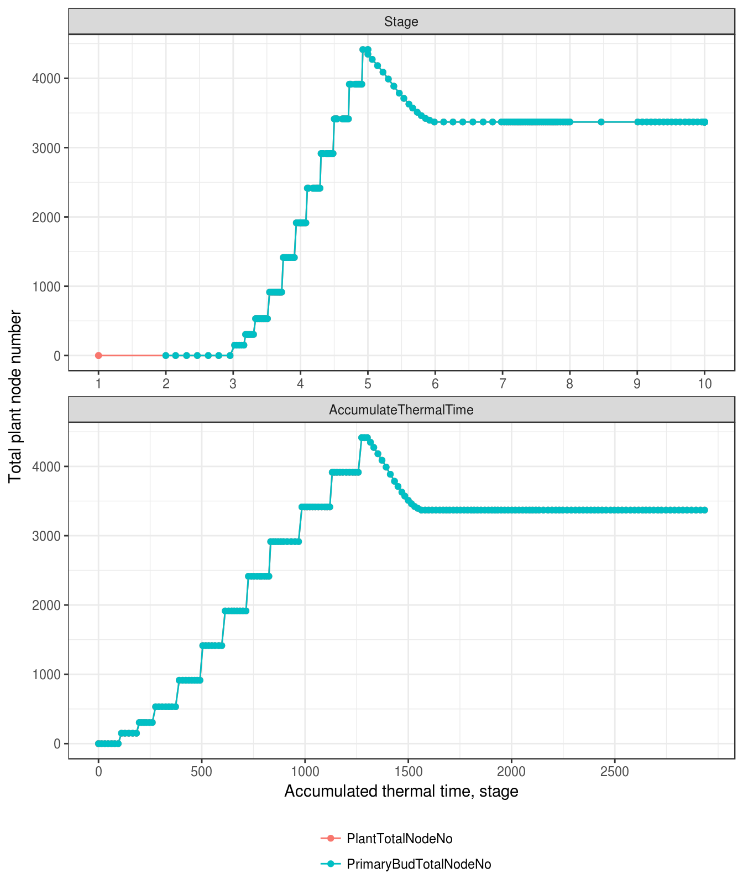

(\#fig:plant-node-number)Total plant node number

## Canopy height

